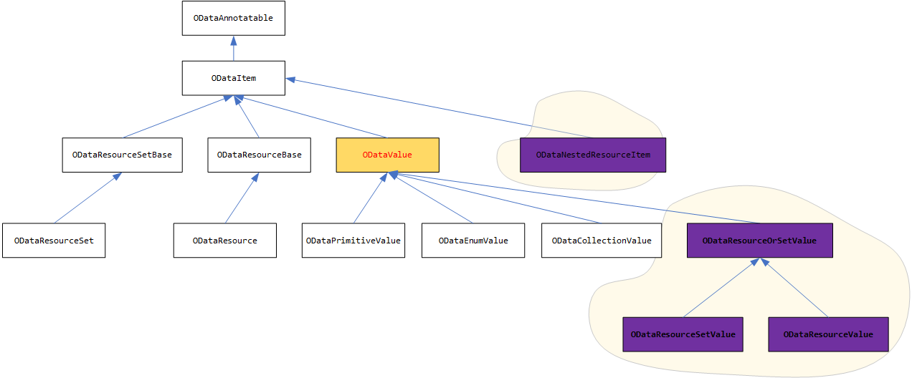
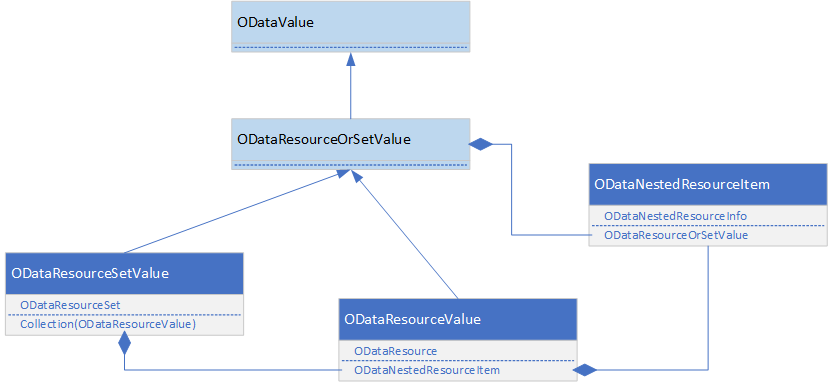

# Support ODataComplexValue in ODL 7.x
saxu@microsoft.com

##	INTRODUCTION
`ODataComplexValue` is widely used in OData libraries v5.x and v6.x. However, it’s removed in OData library v7.x because OData support the navigation property on complex type and tries to treat the complex same as the entity. 
So, the main changes in OData v7.x design are:

- Remove `ODataComplexValue`
- Rename `ODataEntry` as `ODataResource`, use that to represent the instance of entity and complex.
- Rename `ODataFeed` as `ODataResourceSet`, use that to represent the instance of collection of entity or complex

##	PROBLEMS
Along with more and more customers upgrade from ODL v6.x to ODL v7.x, they complain it’s hard to use the library without the `ODataComplexValue`. Because most of OData customers:
1.	Don’t need navigation property on complex type.
2.	Can’t convert the instance of entity or complex easily from literal or to literal. Like the Json.Net

##	SOLUTION
###	CURRENT STRUCTURE

Below is the main inheritance of the ODataValue vs ODataItem in ODL v6.x.


Below is the main inheritance of the ODataValue vs ODataItem in ODL v7.x.


The main changes from v6.x to v7.x are:
1.	ODataComplexValue is removed.
2.	ODataValue is derived from ODataItem.

###	SOLUTION

Avoid introducing breaking changes, we will add three new classes:
1)	ODataResourceOrSetValue: (abstract, derived from ODataValue)
2)	ODataResourceValue: (concrete, derived from ODataResourceOrSetValue)
3)	ODataResourceSetValue: (concrete, derived from ODataResourceOrSetValue)
4) ODataNestedResourceItem: (concrete, derived from ODataItem)

 As below:


##	MAIN WORKS
###	ADD NEW CLASSES

We will add the following three new classes:
```C#
public abstract class ODataResourceOrSetValue : ODataValue
{
    // nothing here.
}

public sealed class ODataNestedResourceItem : ODataItem
{
  public ODataNestedResourceInfo NestedResourceInfo { get; set; }
  public ODataResourceOrSetValue NestedResourceOrSet { get; set; }
}
    
public sealed class ODataResourceValue : ODataResourceOrSetValue
{
   public ODataResource Resource { get; set; }
   public ODataNestedResourceItem NestedItem { get; set; }
}

public sealed class ODataResourceSetValue : ODataResourceOrSetValue
{
   public ODataResourceSet ResourceSet { get; set; }
   public IEnumerable<ODataResourceValue> Items { get; set; }
}
```
Below is the structure of these classes:


###	Convert `ODataResourceOrSetValue` to Url literal 
We should convert the `ODataResourceOrSetValue` to JSON url literal. Same as:
{
   “propertyName”: “propertyValue”
}

###	Convert Url literal to `ODataResourceOrSetValue`
We should read the JSON url literal, convert to `ODataResourceOrSetValue`

###	Support the collection of `ODataResourceOrSetValue`
We should support `ODataCollectionValue` to accept the `ODataResourceOrSetValue` as element.

###	Convert between `ODataResource` and `ODataResourceValue`

We can covert between `ODataResource` and `ODataResourceValue`.

###	Convert between `ODataResourceSet` and `ODataResourceSetValue`

We can covert between `ODataResourceSet` and `ODataResourceSetValue`.

## Open questions

1. Why do we derive ODataNestedResourceItem from ODataItem?

2. Why do we create ODataResourceSetValue? can we use "ODataCollectionValue" for that?
