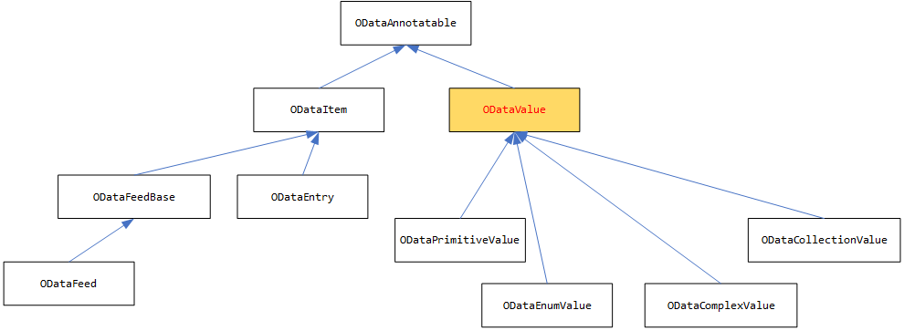
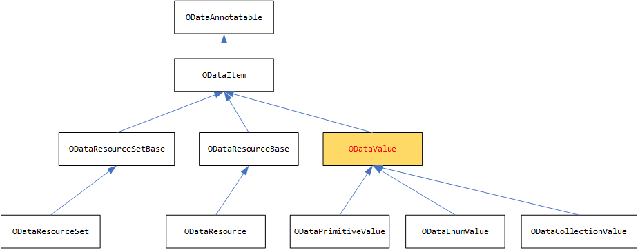
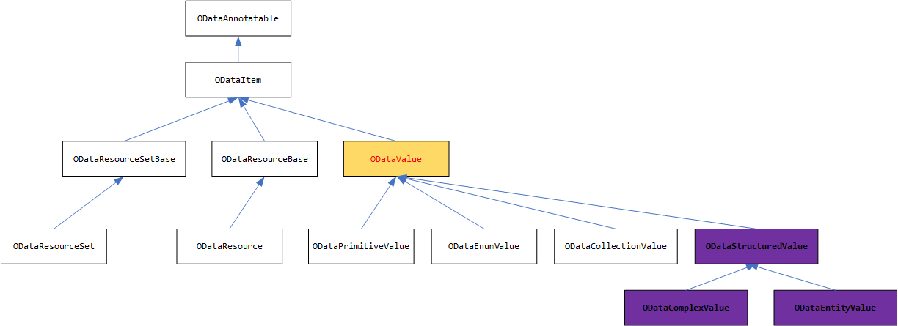
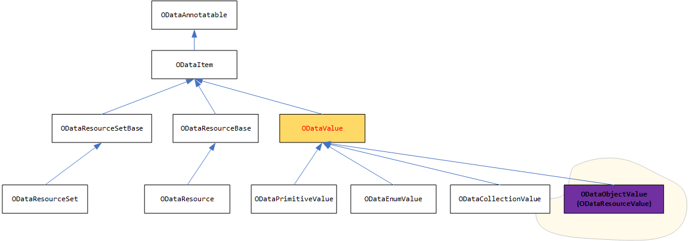

# Support ODataComplexValue in ODL 7.x
saxu@microsoft.com

##	INTRODUCTION
`ODataComplexValue` is widely used in OData libraries v5.x and v6.x. However, it’s removed in OData library v7.x because OData support the navigation property on complex type and tries to treat the complex same as the entity. 
So, the main changes in OData v7.x design are:

- Remove `ODataComplexValue`
- Rename `ODataEntry` as `ODataResource`, use that to represent the instance of entity and complex.
- Rename `ODataFeed` as `ODataResourceSet`, use that to represent the instance of collection of entity or complex

##	PROBLEMS
Along with more and more customers upgrade from ODL v6.x to ODL v7.x, they complain it’s hard to use the library without the `ODataComplexValue`. Because most of OData customers:
1.	Don’t need navigation property on complex type.
2.	Can’t convert the instance of entity or complex easily from literal or to literal. Like the Json.Net

##	SOLUTION
###	CURRENT STRUCTURE

Below is the main inheritance of the ODataValue vs ODataItem in ODL v6.x.



Below is the main inheritance of the ODataValue vs ODataItem in ODL v7.x.



The main changes are:
1.	ODataComplexValue is removed.
2.	ODataValue is derived from ODataItem.

###	SOLUTION

a.	Avoid introducing breaking changes, we will add three new classes:
1)	ODataStructuredValue: (abstract, derived from ODataValue)
2)	ODataComplexValue: (concrete, derived from ODataStructuredValue)
3)	ODataEntityValue: (concrete, derived from ODataStructuredValue)
 As below:


B. or just create a class, for example `ODataObjectValue` or `ODataResourceValue`.


##	MAIN WORKS
###	ADD NEW CLASSES

We will add the following three new classes:
```C#
public abstract class ODataStructuredValue : ODataValue
{
        public IEnumerable<ODataProperty> Properties
        {
            get;
            set;
        }

        public string TypeName
        {
            get;
            set;
        }
}

public class ODataComplexValue : ODataStructuredValue
{ }

public class ODataEntityValue : ODataStructuredValue
{ }
```
Or:
We can create a single new class:
```C#
public class ODataObjectValue : ODataValue
{
    public IEnumerable<ODataProperty> Properties
    {
        get;
        set;
    }

    public string TypeName
    {
        get;
        set;
    }
}
```
Or, use `ODataResourceValue`. Supposed, we use “ODataObjectValue” in the design.


###	Convert ODatObjectValue to Url literal 
We should convert the `ODataObjectValue` to JSON url literal. Same as:
{
   “propertyName”: “propertyValue”
}

###	Convert Url literal to `ODatObjectValue`
We should read the JSON url literal, convert to `ODataObjectValue`

###	Support the collection of ODataObjectValue
We should support `ODataCollectionValue` to accept the `ODataObjectValue` as element.

###	Convert between `ODataResource` and `ODataObjectValue`

We can covert between `ODataResource` and `ODataObjectValue`, but only for the properties.

###	Write `ODataResource`

`ODataResource` can have `ODataObjectValue` property or collection of it.
How about if the `ODataObjectValue` is the entity?

###	Read `ODataResource`

When reading the resource with nested resource, do we read it into `ODataObjectValue` or `ODataResource`?
1.	If it’s entity (navigation property), read as `ODataResource`
2.	If it’s complex with NP, read as `ODataResource`
3.	If it’s complex without NP, read as `ODataObjectValue`? How about if the nested complex has navigation property?
