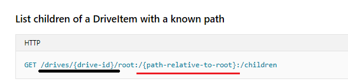

## Problem

OneDrive has scenarios where a segment representing a drive path needs to be inserted within a URL to identify a target drive item. The drive-path-segment represents the driveItem referenced by the drive path navigated from the driveItem represented by the previous segment.
They use a special syntax to escape the segment from being processed as part of an OData URL and use ":/" and ":" as the separator to identify the relative path in the URL. 

See example at: https://docs.microsoft.com/en-us/graph/api/driveitem-list-children?view=graph-rest-1.0



The problem is that ` :/ ... : ` in the path segment is a non odata standard approach.

## Solution

OData introduces a new term which can be applied to bound functions to annotate them as escaped segments.
See the implementation at: https://github.com/OData/odata.net/blob/master/src/Microsoft.OData.Edm/Vocabularies/CommunityVocabularies.xml#L8-L10

```xml
<Term AppliesTo="Function" Type="Core.Tag" Name="UrlEscapeFunction">
  <Annotation Term="Core.Description" String="Annotates a function to be substituted for a colon-escaped segment in a Url path"/>
</Term>
```

The usage is same as other annotation, below is an example:
```xml
<?xml version="1.0" encoding="utf-16"?>
<edmx:Edmx Version="4.0" xmlns:edmx="http://docs.oasis-open.org/odata/ns/edmx">
 <edmx:DataServices>
   <Schema Namespace="NS" xmlns="http://docs.oasis-open.org/odata/ns/edm">
     <EntityType Name="User">
       <Key>
         <PropertyRef Name="Id" /> 
       </Key> 
       <Property Name="Id" Type="Edm.Int32" Nullable="false" />
       <Property Name="Name" Type="Edm.String" /> 
     </EntityType> 
     <Function Name="GetByPath" IsBound="true"> 
       <Parameter Name="bindingParameter" Type="NS.User" /> 
       <Parameter Name="path" Type="Edm.String" /> 
       <ReturnType Type="Edm.Int32" /> 
       <Annotation Term="Org.OData.Community.V1.UrlEscapeFunction" Bool="true" /> 
     </Function> 
     <EntityContainer Name=""Container"">
       <EntitySet Name=""Users"" EntityType=""NS.User"" />
     </EntityContainer>
   </Schema>
 </edmx:DataServices> 
</edmx:Edmx>
```

## Validation

So far, we create the following validations for a bound function which is annotated with `UriEscapeFunction` term:

1. For one binding type, there is at most one escape function for composable binding function, see [here](https://github.com/OData/odata.net/pull/1400/files#diff-cb9c6a124b96938f3493f2aa2e7eb4caR1017).
2. For one binding type, there is at most one escape function for un-composable binding function, see [here](https://github.com/OData/odata.net/pull/1400/files#diff-cb9c6a124b96938f3493f2aa2e7eb4caR1017).
3. Escapable function should have and only have two parameters, the non-binding parameter type should be "Edm.String", see [here](https://github.com/OData/odata.net/blob/master/src/Microsoft.OData.Edm/Validation/ValidationRules.cs#L1753).

## OData Uri parser

Let's use the above CSDL as model:

All of us know that if customer follows up the standard odata Uri, customer should call the function like:

```C#
GET ~/Users({key})/NS.GetByPath(path='abc')
```

Now, the customer can use new Uri pattern to do the same function call as:

```C#
GET ~/Users({key}):/abc
```

The Uri parser returns the same OData path of the normal function call.

Besides, it also supports composable functions, below lists some scenarios:

### Non-Composable function

| Escape Path | Normal Path |
|---|---|
| `~/Users(1):/abc` | `~/Users(1)/NS.Function1(path='abc')` |
| `~/Users(1):/photos/2018/February` | `~/Users(1)/NS.Function1(path='photos/2018/February')` |

### Composable function

| Escape Path | Normal Path |
|---|---|
| `~/Users(1):/abc:` | `~/Users(1)/NS.Function2(path='abc')` |
| `~/Users(1):/photos/2018/February:` | `~/Users(1)/NS.Function2(path='photos/2018/February')` |
| `~/Users(1):/abc:/Name` | `~/Users(1)/NS.Function2(path='abc')/Name` |
| `~/Users(1):/abc::/xyz` | `~/Users(1)/NS.Function2(path='abc')/NS.Function2(path='xyz')` |

Where, 
* `Function1` is an escape **non-composable** bound function
* `Function2` is an escape **composable** bound function, which return type is "NS.User".

It's in final reviewing. See at [here](https://github.com/OData/odata.net/pull/1400).
I hope it can be released in couple days.


